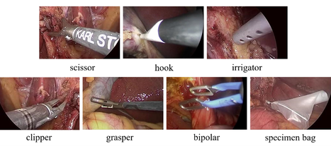
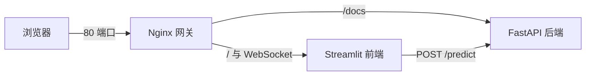

# 手术器械检测系统（Surgical Instrument Detection）

基于 **YOLOv3 + MobileNetV3** 的腹腔镜手术器械检测系统，采用 **FastAPI + Streamlit + Nginx** 前后端分离架构，支持 Docker 一键部署。

上传手术图片后，系统自动识别并框出常见手术器械，标注类别与置信度，可用于手术场景的器械实时识别与计数，并为手术报告的自动生成提供结构化的器械信息。

## 检测类别

本系统识别七类常见手术器械：scissor、hook、irrigator、clipper、grasper、bipolar、specimen bag。

<p align="center">
  
</p>


## 算法特点

以 MobileNetV3 轻量主干替换 Darknet53 并引入 CBAM 注意力机制，参数量降低约 80% 的同时，检测精度与推理速度均明显提升。

| 指标 | YOLOv3 | 本算法 |
| --- | --- | --- |
| mAP-M (%) | 95.77 | **97.65** |
| FPS | 21.45 | **49.81** |
| Parameters (M) | 61.55 | **12.40** |
| FLOPs (G) | 66.17 | **7.44** |

测试条件：以上指标基于 m2cai16-tool-locations（M2CAI16 工具定位公开数据集）测试，在 NVIDIA Quadro RTX 5000 上以 416×416 输入分辨率测得。

## 系统架构



- **Nginx**（80 端口）：统一网关，代理前端页面与后端 API 文档，并转发 Streamlit 所需的 WebSocket。
- **Streamlit**（8501 端口）：前端界面，支持上传图片或选择示例图片，展示检测结果并绘制标注框。
- **FastAPI**（8000 端口）：后端推理服务，模型常驻内存，对外提供 REST API。

## 目录结构

```
.
├── Dockerfile           # PyTorch + CUDA 基础镜像，安装 OpenCV 依赖
├── docker-compose.yml   # 编排 nginx / streamlit / fastapi 三个服务
├── nginx.conf           # Nginx 反向代理配置（含 WebSocket 支持）
├── main.py              # FastAPI 后端入口
├── streamlit_Pre.py     # Streamlit 前端入口
├── yolo.py              # YOLO 模型封装（加载权重、预处理、推理）
├── nets/                # 网络结构定义（YoloBody、MobileNetV3 主干）
├── utils/               # 工具函数（解码、NMS、图像预处理等）
├── model_data/          # 类别文件、先验框 anchors
├── sample_image/        # 前端示例图片
└── logs/                # 训练好的模型权重（需自行放置，未入库，字体同理）
```

## 快速开始（Docker 部署）

### 1. 准备模型权重

请注意仓库中不包含训练好的权重文件，请先将权重放到 `logs/` 目录下。

### 2. 一键启动

```bash
docker compose up -d --build
```

### 3. 访问服务

| 服务 | 地址 |
| --- | --- |
| 前端检测界面 | http://localhost |
| FastAPI 接口文档（Swagger） | http://localhost/docs |

## API 说明

### `GET /`

健康检查，返回服务状态信息。

### `POST /predict`

上传图片进行检测。

```bash
curl -X POST http://localhost:8000/predict \
  -H "Content-Type: multipart/form-data" \
  -F "file=@sample_image/1.jpg"
```

响应示例：

```json
{
  "filename": "1.jpg",
  "inference_time": "0.1234s",
  "detections": [
    {
      "class_name": "Grasper",
      "confidence": 0.87,
      "bbox": { "x_min": 100, "y_min": 50, "x_max": 200, "y_max": 180 }
    }
  ],
  "count": 1
}
```

## 本地开发（不使用 Docker）

```bash
# 安装依赖
pip install -r requirements.txt

# 启动后端（终端 1）
uvicorn main:app --reload --host 0.0.0.0 --port 8000

# 启动前端（终端 2）
streamlit run streamlit_Pre.py
```

> 📌 注意：`streamlit_Pre.py` 中的 `API_URL` 默认为 `http://fastapi-backend:8000/predict`（Docker 容器网络内的服务名）。本地直接运行时，请将其改为 `http://localhost:8000/predict`。

## 常见问题

- **导入 OpenCV 报错 `libGL.so.1`**：Dockerfile 中已安装 `libgl1-mesa-glx` 等依赖，无需额外处理。
- **网页一直显示 Connecting...**：已通过 `nginx.conf` 配置 WebSocket 转发（`Upgrade` / `Connection` 头），请勿删除相关配置。
- **后端报错找不到权重文件**：确认权重已放入 `logs/` 目录，且文件名与 `yolo.py` 的 `model_path` 一致。

## 技术栈

- **深度学习**：PyTorch、YOLOv3（MobileNetV3 主干），网络结构参考 [bubbliiiing/yolo3-pytorch](https://github.com/bubbliiiing/yolo3-pytorch)
- **后端**：FastAPI、Uvicorn
- **前端**：Streamlit
- **部署**：Docker、Docker Compose、Nginx
- **图像处理**：OpenCV、Pillow

## 许可证

本项目采用 [MIT License](LICENSE)。
