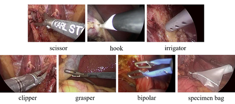
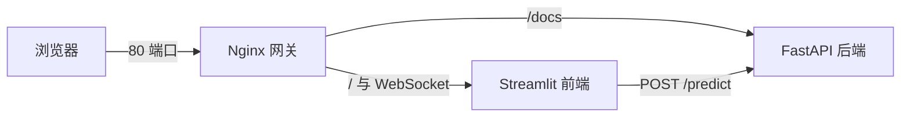

# 手术器械检测系统（Surgical Instrument Detection）

基于 **YOLOv3 + MobileNetV3** 的腹腔镜手术器械检测系统，采用 **FastAPI + Streamlit + Nginx** 前后端分离架构，支持 Docker 一键部署。

上传手术图片后，系统自动识别并框出常见手术器械，标注类别与置信度，可用于手术场景的器械实时识别与计数。

## 检测类别



本系统识别六类常见手术器械：**Grasper**、**Bipolar**、**Hook**、**Scissors**、**Clipper**、**Irrigator**。

## 算法特点

本系统以轻量化为核心设计目标，在 YOLOv3 的基础上做了以下改进：

- **MobileNetV3 轻量主干**：采用倒残差结构、深度可分离卷积与 h-swish 激活的 MobileNetV3 替换原 Darknet53 主干，大幅降低参数量与计算量；
- **CBAM 混合注意力**：在主干网络的残差块中引入通道注意力 + 空间注意力（CBAM），以较小的参数开销增强特征表达，弥补轻量化带来的精度损失；
- **多尺度检测**：保留 YOLOv3 的 13×13 / 26×26 / 52×52 三尺度特征融合结构，兼顾大、中、小目标的检测；
- **CPU 即可推理**：输入分辨率仅 416×416，默认 `cuda = False`，无需 GPU 即可部署在云服务器上。

## 系统架构



- **Nginx**（80 端口）：统一网关，代理前端页面与后端 API 文档，并转发 Streamlit 所需的 WebSocket。
- **Streamlit**（8501 端口）：前端界面，支持上传图片或选择示例图片，展示检测结果并绘制标注框。
- **FastAPI**（8000 端口）：后端推理服务，模型常驻内存，对外提供 REST API。

## 目录结构

```
.
├── Dockerfile           # PyTorch + CUDA 基础镜像，安装 OpenCV 依赖
├── docker-compose.yml   # 编排 nginx / streamlit / fastapi 三个服务
├── nginx.conf           # Nginx 反向代理配置（含 WebSocket 支持）
├── main.py              # FastAPI 后端入口
├── streamlit_Pre.py     # Streamlit 前端入口
├── yolo.py              # YOLO 模型封装（加载权重、预处理、推理）
├── nets/                # 网络结构定义（YoloBody、MobileNetV3 主干）
├── utils/               # 工具函数（解码、NMS、图像预处理等）
├── model_data/          # 类别文件、先验框 anchors、字体
├── sample_image/        # 前端示例图片
└── logs/                # 训练好的模型权重（需自行放置，未入库）
```

## 快速开始（Docker 部署）

### 1. 准备模型权重

> ⚠️ 仓库中不包含训练好的权重文件，请先将权重放到 `logs/` 目录下。

`yolo.py` 中默认加载的权重路径为：

```
logs/ep290-loss0.040-val_loss0.030.pth
```

如权重文件名不同，请同步修改 [yolo.py](yolo.py) 中 `_defaults` 的 `model_path` 配置。

### 2. 一键启动

```bash
docker compose up -d --build
```

### 3. 访问服务

| 服务 | 地址 |
| --- | --- |
| 前端检测界面 | http://localhost |
| FastAPI 接口文档（Swagger） | http://localhost/docs |

## API 说明

### `GET /`

健康检查，返回服务状态信息。

### `POST /predict`

上传图片进行检测。

```bash
curl -X POST http://localhost:8000/predict \
  -H "Content-Type: multipart/form-data" \
  -F "file=@sample_image/1.jpg"
```

响应示例：

```json
{
  "filename": "1.jpg",
  "inference_time": "0.1234s",
  "detections": [
    {
      "class_name": "Grasper",
      "confidence": 0.87,
      "bbox": { "x_min": 100, "y_min": 50, "x_max": 200, "y_max": 180 }
    }
  ],
  "count": 1
}
```

## 本地开发（不使用 Docker）

```bash
# 安装依赖
pip install -r requirements.txt

# 启动后端（终端 1）
uvicorn main:app --reload --host 0.0.0.0 --port 8000

# 启动前端（终端 2）
streamlit run streamlit_Pre.py
```

> 📌 注意：`streamlit_Pre.py` 中的 `API_URL` 默认为 `http://fastapi-backend:8000/predict`（Docker 容器网络内的服务名）。本地直接运行时，请将其改为 `http://localhost:8000/predict`。

## 配置说明

| 配置项 | 位置 | 说明 |
| --- | --- | --- |
| `model_path` | `yolo.py` | 模型权重路径 |
| `classes_path` | `yolo.py` | 类别文件路径（`model_data/instrument_class.txt`） |
| `confidence` | `yolo.py` | 后端保留预测框的置信度阈值（默认 0.5） |
| `cuda` | `yolo.py` | 是否使用 GPU（默认 `False`，有 NVIDIA GPU 可改为 `True`） |
| `CONF_THRESHOLD` | `streamlit_Pre.py` | 前端展示结果的过滤阈值（默认 0.15） |
| pip 镜像源 | `Dockerfile` | 默认腾讯云镜像，中国大陆构建慢时也可换用注释中的清华源 |

## 常见问题

- **导入 OpenCV 报错 `libGL.so.1`**：Dockerfile 中已安装 `libgl1-mesa-glx` 等依赖，无需额外处理。
- **网页一直显示 Connecting...**：已通过 `nginx.conf` 配置 WebSocket 转发（`Upgrade` / `Connection` 头），请勿删除相关配置。
- **后端报错找不到权重文件**：确认权重已放入 `logs/` 目录，且文件名与 `yolo.py` 的 `model_path` 一致。

## 技术栈

- **深度学习**：PyTorch、YOLOv3（MobileNetV3 主干），网络结构参考 [bubbliiiing/yolo3-pytorch](https://github.com/bubbliiiing/yolo3-pytorch)
- **后端**：FastAPI、Uvicorn
- **前端**：Streamlit
- **部署**：Docker、Docker Compose、Nginx
- **图像处理**：OpenCV、Pillow
